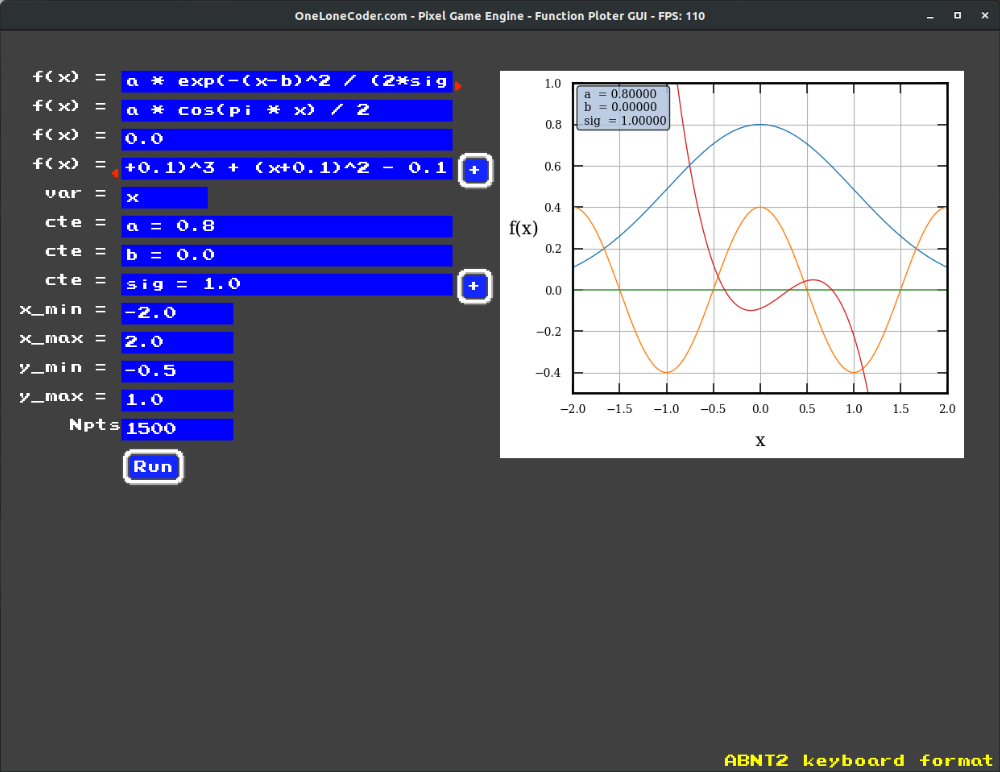

# olcFunctionPloterGUI
A prototype for a GUI application to plot mathematical functions made from the ExprTk parser library and the olcPixelGameEngine.

## Description
This programm allows the definition of multiple mathematical functions, along with any arbitrary constant, 
to be plotted within a given interval. Its main code runs in C++ and heavily relys on the ExprTk parser 
library to convert strings to usable math code, and the olcPixelGameEngine to handle all the manually implemented 
GUI for field selection and writting. All final numerical data produced is plotted with python scripts.

## Usage
To use, select each field and fill it with the desired information:

`f`: function expression to plot (C/C++ syntax). Extra functions can be added with `+`

`var`: the variable name (usually `x`)

`cte`: constants name and value, written as `cte_name = cte_val`. Extra constants can be added with `+`

`x_min`: Bottom value of `var` to calculate

`x_max`: Top value of `var` to calculate

`y_min`: Bottom value of `f(var)` to display in the plot

`y_max`: Top value of `f(var)` to display in the plot

`nPts`: Number of points to calculate within the interval `[x_min, x_max]`

## Install
The makefile attached provides all flags for compilation, considering Linux OS, 
requiring only a `make` command. Although olcPGE is multiplatform, this code is 
primarily made for Linux OS, without any testing in Windows, however, it shall be 
trivially portable. 

In order to run on Linux, the application must be executed with `vblank_mode=0 ./func_ploter`, 
avoiding FPS locking. The olcPGE compilation requires basic obtainable libraries, which 
can be retrieved in Ubuntu with:

`sudo apt install build-essential libglu1-mesa-dev libpng-dev`

More information for other distros can be found at:
https://github.com/OneLoneCoder/olcPixelGameEngine/wiki/Compiling-on-Linux

# Credits
The graphical part of this application is fully developed from and for the olcPixelGameEngine, 
as provided by Javidx9, the One Lone Coder https://github.com/OneLoneCoder/olcPixelGameEngine. 
The convertion from string to usable code is retrieved from the ExprTk library, as made 
available by Arash Partow in https://github.com/ArashPartow/exprtk and http://www.partow.net/programming/exprtk/.
The original README and LICENSE files can be found attached in `licenses/`, along with further 
details in the libraries use.

Implemented by M. Lazarotto (15/01/2021)
